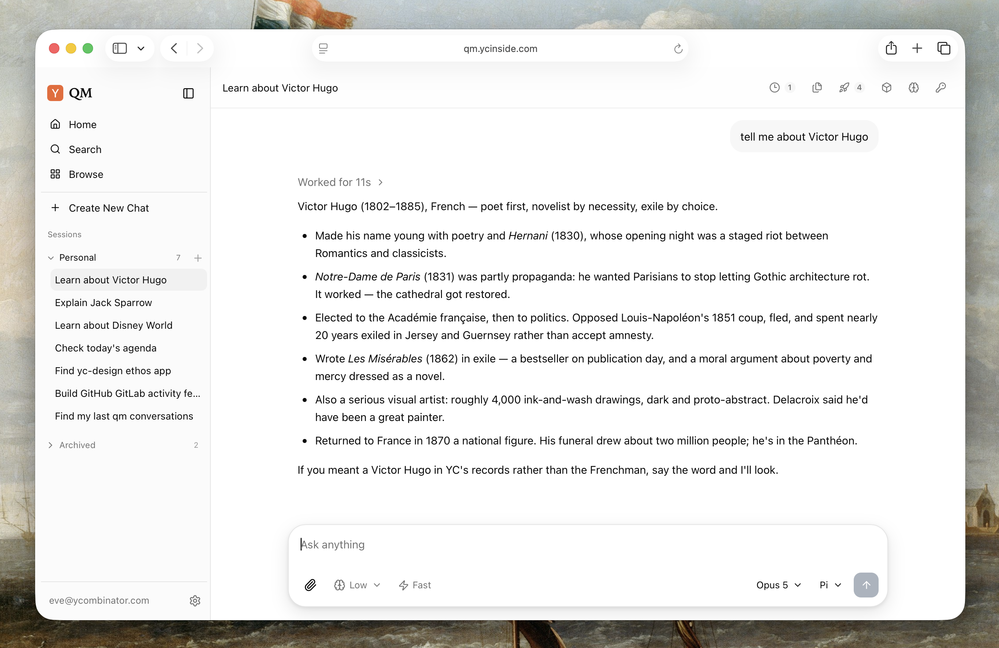
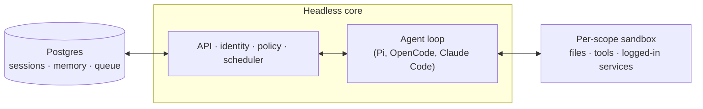

# qm

[简体中文](./README.zh-CN.md)

> This repository is a downstream build of
> [yc-software/qm](https://github.com/yc-software/qm), focused on simpler deployment
> and day-to-day operations.

A multiplayer agent harness for work. In Slack and on the web.



## What is QM?

Most agents are designed like personal assistants. You can make one work for a whole
company, but it quickly gets complex. QM is designed for startups. Employees each get
their own isolated workspace and work independently without affecting each other, and
they can also collaborate with the agent in channels, group messages, and projects.

Each person and each room has its own scoped memory, files, keychain view, permissions,
crons, web apps, and durable sandbox.

It's built with open source in mind. Pick your own harness and model and switch between
them — Pi, OpenCode, Codex, and Claude Code all drive the same core, so a deployment
isn't tied to any single vendor.

## Features

- **Personal and shared scopes.** People customize the agent to be _theirs_, and still
  work with it collaboratively in Slack channels and projects.
- **Slack and web.** The same identity and configuration carries between Slack and the
  web app.
- **Admin control.** Set org-level configuration, a security posture, and which
  harnesses and models are available.
- **Web apps.** Spin up custom internal apps and publish them to the right people.
- **Shared skills.** Skills are scope-owned and shareable by grant, with admin-gated
  promotion to the whole org and skill packs imported from git repositories.
- **Background work.** Crons and watches run work while nobody's watching.

## What you can do with it

- Search internal notes, email, documents, databases, and the web together
- Retrieve information from your company brain
- Build internal apps, publish them to the right people, and keep their data current
- Learn your writing voice from past sends, then triage your inbox on a schedule —
  labels and reply drafts included
- Work in an existing repository: run tests, open PRs, monitor CI, check system logs
- Track a project in a shared channel and post updates and follow-ups

## Architecture



Every turn runs through a central core, which can use a variety of models and harnesses
to generate the response. A Postgres persistence layer holds user data, session history,
and other durable state. The agent has a small, fixed tool surface; one of those tools is
`execute`, which runs commands in the scope's own isolated sandbox — its durable computer,
where installed tools stay installed. The web UI, the admin panel, and the public portal
are optional plugins over the core's HTTP API;
Slack is an optional in-process plugin that core starts
and supervises through a direct service client.

The core runs TypeScript directly on Node and uses Fastify for HTTP. The Slack plugin
uses Bolt; the web UI builds with Vite and renders with Lit.

The core itself is generic. Everything specific to one company — org config, custom tools
and skills, sandbox image, infrastructure — lives in a **deployment directory** that the
[`qm` CLI](./cli/README.md) validates and deploys. Every substrate (harness, session
store, sandbox, memory) sits behind an interface, so production implementations swap in
via one wiring file.

## Security and secrets

QM's approach follows local coding agents like OpenCode, Codex, and Claude Code: the
agent acts as the person it's working for, with their credentials and permissions, and
everything it does is audited. An org picks one security posture, which narrower scopes
can only tighten:

- **Strict** — every harness tool call pauses for human approval, except the two
  no-effect turn enders.
- **Auto** (default) — a classifier screens provenance-labelled external data and tool
  results before they reach the model; a deployment can point that at its own screening
  proxy.
- **Dangerous** — no content screening, no pauses between tool calls.

The predeclared command policy — approval rules and hard denials for things like
recursive deletes or destructive SQL — applies in every posture, Dangerous included.

[`SECURITY.md`](./SECURITY.md) has the threat model, the operator assumptions, and the
known limitations.

## Deploy with Docker Compose

The root [`docker-compose.yaml`](./docker-compose.yaml) builds and runs Postgres, core,
Web UI, Admin, Portal, and Nginx from this source checkout. The optional `auth` profile
adds qm's email sign-in broker.

This is a local-development, evaluation, and single-host reference stack. It does not
provide TLS, high availability, rolling releases, backups, monitoring, resource limits,
or a production-grade sandbox boundary. Core uses host networking and mounts the Docker
socket, so run the stack only on a trusted, single-tenant Linux host. For a hosted
production deployment, use the source-tree CLI described under
[Hosted deployment](#hosted-deployment).

The root Compose stack is different from the Docker target created by `qm init`: their
topologies, ports, configuration, and lifecycle commands are not interchangeable.

### Prerequisites

- Linux or WSL2 with a running Docker Engine and Docker Compose v2
- Node.js 24.15+ and npm 11.10+ to build the local sandbox image
- `openssl` and `curl`
- Free local ports `5432`, `8080`, `8088`, `8090`, `8096`, and `8097`, plus
  `8099` when the `auth` profile is enabled

### Create `.env`

Copy the template, record the Docker socket group, and generate a different random value
for every secret. Keep `.env` out of Git and back up the values needed to decrypt durable
data.

```bash
cp .env.example .env

qm_socket_gid="$(stat -c %g /var/run/docker.sock)"
sed -i "s/^DOCKER_GID=.*/DOCKER_GID=${qm_socket_gid}/" .env

for qm_secret_name in \
  POSTGRES_PASSWORD \
  CONNECTOR_SECRET_KEY \
  CORE_SIGNING_SECRET \
  CAPABILITY_SECRET \
  PORTAL_IDENTITY_SECRET \
  PORTAL_SESSION_SECRET \
  SKILL_SIGNING_SECRET
do
  qm_secret_value="$(openssl rand -hex 32)"
  sed -i "s/^${qm_secret_name}=.*/${qm_secret_name}=${qm_secret_value}/" .env
done
```

On the first boot of a new local database, grant the default development principal
access to Admin:

```bash
sed -i 's/^ADMIN_GRANTS=.*/ADMIN_GRANTS=dev-admin:org_admin/' .env
```

`ADMIN_GRANTS` seeds an empty database once. Later admin changes are durable and are
managed from Admin rather than by editing `.env`.

### Key `.env` settings

Values marked “required” have no safe default. The generated signing and encryption
secrets must be distinct.

| Variable                                                                      | Default or requirement                  | Purpose                                                                                                                                         |
| ----------------------------------------------------------------------------- | --------------------------------------- | ----------------------------------------------------------------------------------------------------------------------------------------------- |
| `POSTGRES_PASSWORD`                                                           | Required                                | Password used by Compose to initialize and connect to Postgres. Changing it after the volume exists does not rotate the database role password. |
| `DOCKER_GID`                                                                  | Required                                | Numeric group ID of `/var/run/docker.sock`, allowing the unprivileged core process to create sandbox containers.                                |
| `CONNECTOR_SECRET_KEY`                                                        | Required                                | Encrypts connector credentials and other durable secret material. Losing it can make stored credentials unreadable.                             |
| `CORE_SIGNING_SECRET`                                                         | Required                                | Authenticates requests between core and trusted services.                                                                                       |
| `CAPABILITY_SECRET`                                                           | Required                                | Signs scoped capability tokens used by sandbox, blob, and egress paths.                                                                         |
| `PORTAL_IDENTITY_SECRET`                                                      | Required                                | Signs the browser identity that Portal forwards to private services and core.                                                                   |
| `PORTAL_SESSION_SECRET`                                                       | Required                                | Signs browser sessions. It must differ from `CORE_SIGNING_SECRET`.                                                                              |
| `SKILL_SIGNING_SECRET`                                                        | Required in production                  | Signs durable skill artifacts. Set it during initial setup even when using the development defaults.                                            |
| `ORG_ID`                                                                      | `acme`                                  | Stable organization identifier. Do not change it after storing organization-scoped data.                                                        |
| `HARNESS`                                                                     | `pi` in `.env.example`; `mock` if unset | Agent harness. `mock` returns canned responses and does not call a model.                                                                       |
| `ANTHROPIC_API_KEY`, `OPENAI_API_KEY`, `OPENROUTER_API_KEY`                   | Optional `.env` fallbacks               | Model-provider credentials. Real `pi` turns need at least one credential, set here or later in Admin.                                           |
| `HARNESS_SECURITY_POSTURE`                                                    | `auto`                                  | `strict`, `auto`, or `dangerous`; see [Security and secrets](#security-and-secrets).                                                            |
| `ADMIN_GRANTS`                                                                | Empty                                   | One-time seed in the form `<principal>:org_admin`; local bypass uses `dev-admin`.                                                               |
| `WEB_UI_PRINCIPALS`                                                           | Empty                                   | Optional comma-separated principal allowlist. Empty allows any principal verified by Portal; set it when only a subset should have access.      |
| `QM_BIND_ADDRESS`, `QM_HTTP_PORT`                                             | `127.0.0.1`, `8088`                     | Nginx browser entry point.                                                                                                                      |
| `QM_INTERNAL_BIND_ADDRESS`                                                    | `127.0.0.1`                             | Bind address for Postgres and direct Web UI, Admin, Portal, and auth diagnostic ports. It does not restrict core's host-networked port `8080`.  |
| `PORTAL_PUBLIC_URL`                                                           | `http://localhost:8088`                 | Browser-visible origin; use the externally reachable HTTPS URL in production.                                                                   |
| `PORTAL_LOCAL_AUTH_BYPASS`                                                    | `1`                                     | Development-only login as `PORTAL_DEV_PRINCIPAL`. Set to `0` before any non-local exposure.                                                     |
| `PORTAL_XFF_TRUSTED_HOPS`                                                     | `1`                                     | Number of trusted reverse proxies used to derive client addresses. Match the real proxy chain.                                                  |
| `OIDC_ALLOWED_EMAIL_DOMAIN`, `OIDC_ALLOWED_EMAILS`, `PORTAL_EXPECTED_TEAM_ID` | At least one in production              | Limits sign-in to an email domain, explicit email list, or Slack workspace.                                                                     |
| `RATE_LIMIT_PER_WINDOW`, `RATE_LIMIT_WINDOW_MS`                               | `60`, `60000`                           | Per-principal request limit and window in milliseconds.                                                                                         |
| `BUDGET_USD_PER_WINDOW`, `ORG_BUDGET_USD_PER_WINDOW`, `BUDGET_WINDOW_MS`      | `25`, `100`, `86400000`                 | Per-principal and organization model-spend budgets and their window.                                                                            |

For production OIDC, set `NODE_ENV=production`, `PORTAL_LOCAL_AUTH_BYPASS=0`, an
HTTPS `PORTAL_PUBLIC_URL`, all `OIDC_*` endpoint and client settings, and at least one
identity boundary: `OIDC_ALLOWED_EMAIL_DOMAIN`, `OIDC_ALLOWED_EMAILS`, or
`PORTAL_EXPECTED_TEAM_ID`. The optional built-in broker additionally requires the
`AUTH_*` signing/client settings, an email allowlist, and either Resend or SMTP
credentials; start it with `--profile auth`. See
[`docs/docker-compose.md`](./docs/docker-compose.md),
[`plugins/portal/README.md`](./plugins/portal/README.md), and
[`plugins/auth/README.md`](./plugins/auth/README.md) for the complete contracts.

### Build, start, and verify

Install dependencies, build the sandbox image used for real agent turns, validate the
resolved Compose configuration, and start the stack:

```bash
npm ci
npm run sandbox:local:build
docker compose config --quiet
docker compose up -d --build --wait
```

The default stack omits the optional email broker. Include it when its `AUTH_*`
configuration is ready:

```bash
docker compose --profile auth up -d --build --wait
```

Check process liveness, then open the browser surfaces:

```bash
curl -fsS http://127.0.0.1:8080/healthz
curl -fsS http://127.0.0.1:8088/healthz
```

- Web UI: <http://localhost:8088/>
- Admin: <http://localhost:8088/admin/>

`--wait` and `/healthz` prove only that the processes are alive. Before relying on the
deployment, sign in, run a real agent turn, confirm that a sandbox is created, and verify
the model and any required connectors.

### Operate and upgrade

```bash
docker compose ps
docker compose logs -f --tail=200 core portal nginx
docker compose down
```

`postgres-data` and `core-data` survive `docker compose down`. Per-scope sandbox homes
live in separate `qm-home-*` Docker volumes. `docker compose down -v` deletes the two
Compose-managed volumes but does not remove those sandbox volumes; never use it as an
ordinary stop command.

After checking out an approved revision, rebuild the sandbox and application images:

```bash
npm ci
npm run sandbox:local:build
docker compose up -d --build --wait
```

Take and test a backup before upgrading. A complete recovery plan covers Postgres,
`core-data`, every `qm-home-*` volume, and the secrets needed to decrypt or verify them.
Compose does not provide database rollback, high availability, or zero-downtime rollout.

### Security boundary

- Never expose the stack through a proxy, tunnel, port forward, or non-loopback bind while
  `PORTAL_LOCAL_AUTH_BYPASS=1`.
- Expose only a TLS-terminating edge. Keep Postgres and the direct core, Web UI, Admin,
  Portal, and auth ports private. Core port `8080` uses host networking and must also be
  blocked by the host firewall.
- Mounting `/var/run/docker.sock` gives core near-root control of the host. Do not run this
  stack on a shared or untrusted machine.
- Add external secret management, database backups with restore drills, monitoring,
  alerting, log rotation, resource limits, and an isolated sandbox before treating the
  reference stack as a production service.

### Hosted deployment

Fly.io and AWS deployments use the current source tree and an organization layer. Do not
initialize this private fork from the public `@yc-software/qm` package because that would
omit downstream changes.

```bash
npm ci
node cli/bin/qm.ts init deploy/layers/<org> --org <slug> --target <fly-or-aws>
node cli/bin/qm.ts check --config deploy/layers/<org>/qm.config.jsonc
```

Then follow [`deployment.md`](./deployment.md) and the generated layer runbook. These
hosted targets use their own managed edge and do not use the root Compose stack.

## Contributing

We take contributions as _human-written_ text, not code — see
[`CONTRIBUTING.md`](./CONTRIBUTING.md). Describe the change you'd like informally in a
`.txt` or `.md` file in [`adrs/`](./adrs/), and if we're aligned we'll handle the
implementation. Report vulnerabilities privately — see [`SECURITY.md`](./SECURITY.md),
not a public issue.

## Customize your instance

The deployment repository above carries config and a sandbox layer, and never needs a
source checkout. Some organizations want the opposite trade: the whole codebase in one
place, so engineers and coding agents read core and customizations together, while the
customizations themselves stay private. This repository follows that **private
downstream** model: its history begins as a clone of qm, while deployment-focused
improvements and other local changes may intentionally diverge from upstream.

Populate it once, then clone it to work in:

```bash
gh repo create <org>/qm-private --private

git clone --bare git@github.com:yc-software/qm qm-seed.git
git -C qm-seed.git push --mirror git@github.com:<org>/qm-private
rm -rf qm-seed.git

git clone git@github.com:<org>/qm-private
git -C qm-private remote add upstream git@github.com:yc-software/qm
```

Create the private fork with a plain clone, as shown above, and never with GitHub's fork
feature. The word "fork" here names the concept — a downstream copy that diverges
deliberately and merges from upstream — not GitHub's Fork button. A GitHub fork inherits
the visibility of the repository it came from, so a fork of a public repository cannot be
made private. A GitHub fork also shares one object network with the repository it came
from, so commits pushed to the fork stay fetchable by SHA from the public side. Many
organizations disallow forking private repositories as well. A plain clone has none of
these problems, and it costs one thing: the clone is an ordinary repository, so upstream's
CI workflows run live in your own account. Expect to supply the secrets those workflows
need, or disable the ones you do not want running.

Everything specific to your organization goes in `deploy/layers/<org>/` — config, sandbox
tools and skills, plugin images, infrastructure — in the same shape `qm init` produces. See
[`deploy/layers/README.md`](./deploy/layers/README.md). Keeping organization-specific data
inside that boundary still makes upstream merges easier even when shared code diverges.

Use `update-qm` when deliberately merging upstream qm into this repository. Upstream updates
are merged rather than rebased, and downstream changes remain in this repository.

## Going deeper

- [`docs/getting-started.md`](./docs/getting-started.md) — first run, end to end
- [`cli/README.md`](./cli/README.md) — the `qm` CLI and the deployment directory contract
- [`docs/deploy-directory.md`](./docs/deploy-directory.md) — the deployment directory in full
- [`.env.example`](./.env.example) — every knob, documented in place
- [`plugins/`](./plugins) — the surfaces (Slack, web UI, admin, portal)

## License

Except where otherwise noted, QM is available under the [MIT License](./LICENSE).
