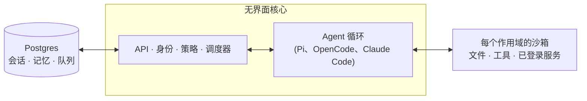

# qm

[English](./README.md)

> 本项目是基于 [yc-software/qm](https://github.com/yc-software/qm) 的二次开发版本，主要用于简化部署和日常运维。

一个服务于工作的多人 Agent 运行框架，可在 Slack 和网页中使用。


## QM 是什么？

大多数 Agent 都是按个人助手设计的。虽然也能让一个 Agent 为整个公司工作，但系统很快就会变得复杂。QM 面向初创公司设计：每位员工都有独立的工作空间，彼此之间互不影响，同时也能在频道、群聊和项目中与 Agent 协作。

每个人和每个房间都有各自作用域内的记忆、文件、密钥链视图、权限、定时任务、Web 应用和持久化沙箱。

QM 按开源和可替换性设计。你可以选择自己的运行框架与模型，也可以随时切换。Pi、OpenCode、Codex 和 Claude Code 都驱动同一个核心，因此部署不会绑定到单一供应商。

## 功能

- **个人与共享作用域。** 每个人都能把 Agent 定制成自己的助手，同时继续在 Slack 频道和项目中协作。
- **Slack 与网页。** 同一套身份和配置可跨 Slack 与 Web 应用使用。
- **管理控制。** 配置组织级设置、安全策略，以及允许使用的运行框架和模型。
- **Web 应用。** 创建内部应用并发布给合适的用户，同时保持数据更新。
- **共享技能。** 技能归作用域所有，可通过授权共享；管理员可以将技能提升到全组织，也可以从 Git 仓库导入技能包。
- **后台工作。** 定时任务和监视任务可以在无人关注时继续运行。

## 可以用它做什么？

- 同时搜索内部笔记、邮件、文档、数据库和网页
- 从公司的知识库中检索信息
- 构建内部应用、发布给合适的用户并持续更新数据
- 从历史发件中学习写作风格，然后定时整理收件箱，包括标签和回复草稿
- 在现有代码仓库中运行测试、创建 PR、监控 CI 和查看系统日志
- 在共享频道中跟踪项目并发布进度和后续事项

## 架构



每一轮交互都会经过中央核心；核心可以使用不同的模型和运行框架生成回复。Postgres 持久层保存用户数据、会话历史和其他持久状态。Agent 只有一组精简且固定的工具，其中 `execute` 用于在当前作用域的独立沙箱中执行命令。这个沙箱是 Agent 的持久计算机，已安装的工具会持续保留。

Web UI、管理面板和公共 Portal 都是基于核心 HTTP API 的可选插件。Slack 是由核心通过直接服务客户端启动和监管的可选进程内插件。

核心直接在 Node 上运行 TypeScript，并使用 Fastify。Slack 插件使用 Bolt；Web UI 使用 Vite 构建并通过 Lit 渲染。

核心本身与具体公司无关。组织配置、自定义工具与技能、沙箱镜像和基础设施等公司专属内容，都位于由 [`qm` CLI](./cli/README.md) 校验和部署的**部署目录**中。运行框架、会话存储、沙箱和记忆等基础能力都位于接口之后，因此生产实现可以通过一个装配文件替换。

## 安全与密钥

QM 的方式与 OpenCode、Codex 和 Claude Code 等本地编程 Agent 类似：Agent 以当前用户的身份工作，使用该用户的凭据和权限，所有操作都进入审计记录。组织选择一种安全策略，更小的作用域只能收紧它：

- **Strict（严格）**：除两个无副作用的结束工具外，每次运行框架工具调用都暂停并等待人工批准。
- **Auto（自动，默认）**：在带来源标签的外部数据和工具结果进入模型前，由分类器进行筛查；部署也可以使用自有的筛查代理。
- **Dangerous（危险）**：不进行内容筛查，工具调用之间也不暂停。

预声明命令策略中的批准规则，以及对递归删除或破坏性 SQL 等操作的硬性禁止，适用于所有安全策略，包括 Dangerous。

[`SECURITY.md`](./SECURITY.md) 说明了威胁模型、运维方假设和已知限制。

## 使用 Docker Compose 部署

### 仅拉取镜像的单机生产部署

[`compose.production.yaml`](./compose.production.yaml) 是单机生产部署包。它从 Docker Hub
运行 QM 服务，并内置必需的 `auth` 邮件登录代理。生产主机只需要 Docker Engine、Docker
Compose v2、`curl`、`cosign` 和负责 TLS 终止的反向代理或负载均衡器；**不需要**源码工作树、
Node.js、npm 或本地构建镜像。

发布清单 [`images.production.env`](./images.production.env) 默认使用 Docker Hub 命名空间
`lijixing`。每个 `QM_*_IMAGE` 都固定为不可变的 `@sha256:` digest。该清单是发布版本的一部分；
不要把 digest 改成标签或 `latest`。生产镜像只支持 Linux `amd64`/`x86_64` 主机。

独立的 `release-production-images.yml` 工作流只从 `main` 发布，并要求输入
`prod-vMAJOR.MINOR.PATCH` 格式的版本，例如 `prod-v0.6.0`；现有 Release 和 CLI 工作流不会发布
这套生产镜像。发布前，必须通过 GitHub 规则禁止更新或删除 `prod-v*` Git 标签，在每个 Docker Hub
目标仓库启用相同模式的不可变标签，并配置发布主体独占、最小推送权限的 `DOCKERHUB_TOKEN`
Environment secret，不能配置为普通仓库 secret。GitHub 的 `production-images` Environment
必须要求发布审批、只允许 `main` 部署，并限制审批人。还要创建私有仓库
`lijixing/qm-production-staging`；候选镜像只在该仓库中接受扫描，
超过 30 天恢复窗口的构建标签应及时清理，且绝不能用于部署。如果部分版本标签已经写入后发布中断，
使用失败工作流的 `resume_run_id` 再次调度，复用保留 30 天的原始签名 digest 产物，不能重新构建。
生成的 digest 清单是不可变的发布记录，部署和回滚都必须使用它。

[`.env.production.example`](./.env.production.example) 的每个配置项都有匿名且格式有效的示例值，
包括密钥和私有 JWK。这些值只是文档样例，绝不能直接部署。使用初始化脚本创建真实配置；脚本会生成彼此不同的替换密钥、私有 JWK 和 Docker socket 组 ID，且不会输出密钥值：

```bash
QM_RELEASE=prod-v0.6.0
mkdir qm-production && cd qm-production
curl -fsSLO "https://github.com/xingstudy/yc-qm/releases/download/${QM_RELEASE}/compose.production.yaml"
curl -fsSLO "https://github.com/xingstudy/yc-qm/releases/download/${QM_RELEASE}/.env.production.example"
curl -fsSLO "https://github.com/xingstudy/yc-qm/releases/download/${QM_RELEASE}/images.production.env"
curl -fsSLO "https://github.com/xingstudy/yc-qm/releases/download/${QM_RELEASE}/images.production.json"
curl -fsSLO "https://github.com/xingstudy/yc-qm/releases/download/${QM_RELEASE}/SHA256SUMS"
curl -fsSLO "https://github.com/xingstudy/yc-qm/releases/download/${QM_RELEASE}/SHA256SUMS.bundle"
mkdir -p scripts
curl -fsSL "https://github.com/xingstudy/yc-qm/releases/download/${QM_RELEASE}/init-production-env.sh" -o scripts/init-production-env.sh
chmod 700 scripts/init-production-env.sh
cosign verify-blob \
  --bundle SHA256SUMS.bundle \
  --certificate-identity='https://github.com/xingstudy/yc-qm/.github/workflows/release-production-images.yml@refs/heads/main' \
  --certificate-oidc-issuer=https://token.actions.githubusercontent.com \
  SHA256SUMS
sha256sum -c SHA256SUMS
docker login
while IFS='=' read -r _ image; do
  cosign verify "$image" \
    --certificate-identity='https://github.com/xingstudy/yc-qm/.github/workflows/release-production-images.yml@refs/heads/main' \
    --certificate-oidc-issuer=https://token.actions.githubusercontent.com > /dev/null
done < images.production.env
./scripts/init-production-env.sh
```

首次启动前编辑 `.env.production`，替换公开 HTTPS 地址、组织 ID、初始管理员授权、允许登录的邮箱域或邮箱、发件人和 SMTP 凭据、模型供应商凭据等运营样例值。将脚本生成的密钥安全保存到密钥管理系统。使用内置登录代理还必须填写邮件传输配置；Issuer、回调地址和私有端点必须始终与模板中的公开 URL 及 `auth` 服务配置一致。

完成签名校验和配置后，再校验、拉取并只启动 digest 固定的镜像：

```bash
docker compose --env-file .env.production -f compose.production.yaml config --quiet
docker compose --env-file .env.production -f compose.production.yaml pull
docker compose --env-file .env.production -f compose.production.yaml up -d --wait --pull always
docker compose --env-file .env.production -f compose.production.yaml ps
curl -fsS http://127.0.0.1:8088/healthz
```

`--wait` 和 `/healthz` 只能证明服务存活。验收安装前，请使用已配置的初始管理员授权完成浏览器登录、运行一次非 mock 的真实 Agent 对话、确认创建了 `qm-sandbox-local` 容器，并验证模型供应商和所需连接器。`QM_SANDBOX_IMAGE` 同样固定为 digest；只有 sandbox base 镜像不能支撑真实对话。

升级前必须备份并演练恢复 Postgres、`core-data` 和所有 `qm-home-*` 卷。将生成的签名和加密配置与备份一起保存；丢失 `CONNECTOR_SECRET_KEY` 可能导致已保存的连接器凭据无法读取。日常停止或升级时绝不可使用 `docker compose down -v`。升级时获取一整套新的匹配发布文件，审阅新的 `.env.production.example` 与 `images.production.env`，备份后执行 `pull` 和 `up -d --wait --pull always`。回滚时必须同时恢复上一套完整镜像清单和配置；若版本间数据不兼容，还要恢复数据库和卷。

这仍是单机部署，不提供高可用或零停机发布。内置 HTTP edge 默认使用
`QM_BIND_ADDRESS=127.0.0.1`，只允许同机 TLS 反代访问，不能直接对外暴露；保持 Postgres
和所有应用直连端口私有。`PORTAL_XFF_TRUSTED_HOPS=2` 表示外部 TLS 代理加内置 edge
两跳受信任代理；同时必须通过主机防火墙阻断使用 host network 的 core `8080` 端口。core
挂载 `/var/run/docker.sock` 后能够创建容器，等价于接近宿主机 root 的权限；只能运行在
可信、单租户 Linux 主机上，不能用于共享机器。对公网服务前还必须配置主机防火墙、备份恢复演练、
监控告警、日志轮换、资源限制和隔离沙箱边界。

如果任何凭据曾粘贴到聊天、工单、Shell 历史或早期环境文件中，部署前必须轮换。包括数据库和邮件凭据、OAuth/OIDC 客户端凭据与私有 JWK、所有签名/会话/Token 密钥，以及模型供应商密钥。数据库初始化后修改密码还必须同步修改数据库角色；替换加密密钥需要有计划地迁移已有凭据。

### 源码构建的开发与参考栈

根目录的 [`docker-compose.yaml`](./docker-compose.yaml) 会从当前源码工作树构建并运行 Postgres、core、Web UI、Admin、Portal 和 Nginx。可选的 `auth` profile 会增加 QM 内置的邮件登录代理。

这是一套面向本地开发、评估和单机运行的参考栈，不提供 TLS、高可用、滚动发布、备份、监控、资源限制或生产级沙箱隔离。core 使用宿主机网络并挂载 Docker socket，因此只能在可信、单租户的 Linux 主机上运行。托管生产部署请使用[托管部署](#托管部署)中说明的源码树 CLI。

根目录 Compose 与 `qm init` 创建的 Docker target 是两套不同方案；它们的拓扑、端口、配置和生命周期命令不能混用。

### 前置条件

- Linux 或 WSL2，并已运行 Docker Engine 和 Docker Compose v2
- Node.js 24.15+ 和 npm 11.10+，用于构建本地沙箱镜像
- `openssl` 和 `curl`
- 本机端口 `5432`、`8080`、`8088`、`8090`、`8096` 和 `8097` 未被占用；启用 `auth` profile 时还需要端口 `8099`

### 创建 `.env`

复制模板，记录 Docker socket 的组 ID，并为每个密钥生成不同的随机值。不要把 `.env` 提交到 Git；需要解密持久数据的值还必须安全备份。

```bash
cp .env.example .env

qm_socket_gid="$(stat -c %g /var/run/docker.sock)"
sed -i "s/^DOCKER_GID=.*/DOCKER_GID=${qm_socket_gid}/" .env

for qm_secret_name in \
  POSTGRES_PASSWORD \
  CONNECTOR_SECRET_KEY \
  CORE_SIGNING_SECRET \
  CAPABILITY_SECRET \
  PORTAL_IDENTITY_SECRET \
  PORTAL_SESSION_SECRET \
  SKILL_SIGNING_SECRET
do
  qm_secret_value="$(openssl rand -hex 32)"
  sed -i "s/^${qm_secret_name}=.*/${qm_secret_name}=${qm_secret_value}/" .env
done
```

首次启动全新的本地数据库时，为默认开发用户授予 Admin 权限：

```bash
sed -i 's/^ADMIN_GRANTS=.*/ADMIN_GRANTS=dev-admin:org_admin/' .env
```

`ADMIN_GRANTS` 只在空数据库中执行一次初始化。之后的管理员变更会持久保存，并应在 Admin 中管理，而不是继续修改 `.env`。

### `.env` 关键参数

标记为“必填”的值没有安全默认值。生成的签名和加密密钥必须彼此不同。

| 变量                                                                          | 默认值或要求                                | 用途                                                                                                      |
| ----------------------------------------------------------------------------- | ------------------------------------------- | --------------------------------------------------------------------------------------------------------- |
| `POSTGRES_PASSWORD`                                                           | 必填                                        | Compose 初始化和连接 Postgres 使用的密码。数据卷创建后再修改该值，不会自动轮换数据库角色密码。            |
| `DOCKER_GID`                                                                  | 必填                                        | `/var/run/docker.sock` 的数字组 ID，使非 root 的 core 进程能够创建沙箱容器。                              |
| `CONNECTOR_SECRET_KEY`                                                        | 必填                                        | 加密连接器凭据和其他持久密钥材料。丢失后，已存储的凭据可能无法读取。                                      |
| `CORE_SIGNING_SECRET`                                                         | 必填                                        | 认证 core 与可信服务之间的请求。                                                                          |
| `CAPABILITY_SECRET`                                                           | 必填                                        | 为沙箱、blob 和出口流量路径使用的作用域能力令牌签名。                                                     |
| `PORTAL_IDENTITY_SECRET`                                                      | 必填                                        | 为 Portal 转发给私有服务和 core 的浏览器身份签名。                                                        |
| `PORTAL_SESSION_SECRET`                                                       | 必填                                        | 为浏览器会话签名，必须与 `CORE_SIGNING_SECRET` 不同。                                                     |
| `SKILL_SIGNING_SECRET`                                                        | 生产环境必填                                | 为持久化技能制品签名。即使使用开发默认配置，也建议在初始化时生成。                                        |
| `ORG_ID`                                                                      | `acme`                                      | 稳定的组织标识。写入组织作用域数据后不要再修改。                                                          |
| `HARNESS`                                                                     | `.env.example` 中为 `pi`；未设置时为 `mock` | Agent 运行框架。`mock` 只返回固定回复，不调用模型。                                                       |
| `ANTHROPIC_API_KEY`、`OPENAI_API_KEY`、`OPENROUTER_API_KEY`                   | 可选的 `.env` 回退值                        | 模型供应商凭据。运行真实 `pi` 对话至少需要一个凭据，可在此处设置，也可稍后在 Admin 中配置。               |
| `HARNESS_SECURITY_POSTURE`                                                    | `auto`                                      | 可设为 `strict`、`auto` 或 `dangerous`；参见[安全与密钥](#安全与密钥)。                                   |
| `ADMIN_GRANTS`                                                                | 空                                          | 格式为 `<principal>:org_admin` 的一次性初始化值；本地免登录用户为 `dev-admin`。                           |
| `WEB_UI_PRINCIPALS`                                                           | 空                                          | 可选的逗号分隔用户白名单。空值允许 Portal 验证的所有用户；只有部分用户应访问时再设置。                    |
| `QM_BIND_ADDRESS`、`QM_HTTP_PORT`                                             | `127.0.0.1`、`8088`                         | Nginx 浏览器入口。                                                                                        |
| `QM_INTERNAL_BIND_ADDRESS`                                                    | `127.0.0.1`                                 | Postgres 及 Web UI、Admin、Portal、auth 诊断端口的绑定地址；它不能限制使用宿主机网络的 core 端口 `8080`。 |
| `PORTAL_PUBLIC_URL`                                                           | `http://localhost:8088`                     | 浏览器可见的源地址；生产环境应设置为外部可访问的 HTTPS URL。                                              |
| `PORTAL_LOCAL_AUTH_BYPASS`                                                    | `1`                                         | 仅供开发使用，以 `PORTAL_DEV_PRINCIPAL` 免登录。任何非本地暴露前都必须改为 `0`。                          |
| `PORTAL_XFF_TRUSTED_HOPS`                                                     | `1`                                         | 推导客户端地址时信任的反向代理层数，必须与真实代理链一致。                                                |
| `OIDC_ALLOWED_EMAIL_DOMAIN`、`OIDC_ALLOWED_EMAILS`、`PORTAL_EXPECTED_TEAM_ID` | 生产环境至少设置一个                        | 将登录限制到指定邮件域、明确的邮件列表或 Slack 工作区。                                                   |
| `RATE_LIMIT_PER_WINDOW`、`RATE_LIMIT_WINDOW_MS`                               | `60`、`60000`                               | 每个用户的请求上限和窗口长度（毫秒）。                                                                    |
| `BUDGET_USD_PER_WINDOW`、`ORG_BUDGET_USD_PER_WINDOW`、`BUDGET_WINDOW_MS`      | `25`、`100`、`86400000`                     | 每个用户及整个组织的模型费用预算和预算窗口。                                                              |

生产 OIDC 至少要设置 `NODE_ENV=production`、`PORTAL_LOCAL_AUTH_BYPASS=0`、HTTPS `PORTAL_PUBLIC_URL`、完整的 `OIDC_*` 端点与客户端参数，并配置 `OIDC_ALLOWED_EMAIL_DOMAIN`、`OIDC_ALLOWED_EMAILS` 或 `PORTAL_EXPECTED_TEAM_ID` 中至少一个身份边界。可选的内置登录代理还需要 `AUTH_*` 签名与客户端参数、邮件白名单，以及 Resend 或 SMTP 凭据；使用 `--profile auth` 启动。完整约束参见 [`docs/docker-compose.md`](./docs/docker-compose.md)（英文）、[`plugins/portal/README.md`](./plugins/portal/README.md)（英文）和 [`plugins/auth/README.md`](./plugins/auth/README.md)（英文）。

### 构建、启动与验证

安装依赖、构建真实 Agent 对话使用的沙箱镜像、校验 Compose 展开结果，然后启动服务：

```bash
npm ci
npm run sandbox:local:build
docker compose config --quiet
docker compose up -d --build --wait
```

默认栈不包含可选的邮件登录代理。准备好 `AUTH_*` 配置后，可一并启动：

```bash
docker compose --profile auth up -d --build --wait
```

检查进程存活状态，然后打开浏览器页面：

```bash
curl -fsS http://127.0.0.1:8080/healthz
curl -fsS http://127.0.0.1:8088/healthz
```

- Web UI：<http://localhost:8088/>
- Admin：<http://localhost:8088/admin/>

`--wait` 和 `/healthz` 只能证明进程存活，不能证明端到端可用。正式依赖该部署前，还应完成登录、运行一次真实 Agent 对话、确认沙箱成功创建，并验证模型和必要的连接器。

### 运维与升级

```bash
docker compose ps
docker compose logs -f --tail=200 core portal nginx
docker compose down
```

`postgres-data` 和 `core-data` 会在 `docker compose down` 后保留。每个作用域的沙箱主目录位于独立的 `qm-home-*` Docker 卷中。`docker compose down -v` 会删除 Compose 管理的两个卷，但不会删除这些沙箱卷；不要把它当作普通停止命令。

切换到已批准的新版本后，重新构建沙箱和应用镜像：

```bash
npm ci
npm run sandbox:local:build
docker compose up -d --build --wait
```

升级前应创建并验证备份。完整恢复方案必须覆盖 Postgres、`core-data`、所有 `qm-home-*` 卷，以及解密或验证这些数据所需的密钥。Compose 不提供数据库回滚、高可用或零停机发布。

### 安全边界

- `PORTAL_LOCAL_AUTH_BYPASS=1` 时，绝不能通过代理、隧道、端口转发或非回环地址暴露该服务。
- 只公开具备 TLS 终止能力的边缘入口。Postgres 以及 core、Web UI、Admin、Portal、auth 的直连端口必须保持私有。core 的 `8080` 端口使用宿主机网络，还必须通过主机防火墙隔离。
- 挂载 `/var/run/docker.sock` 会赋予 core 接近宿主机 root 的控制能力。不要在共享或不可信机器上运行本栈。
- 将参考栈作为生产服务前，必须补充外部密钥管理、经过恢复演练的数据库备份、监控、告警、日志轮换、资源限制和隔离沙箱。

### 托管部署

Fly.io 和 AWS 部署使用当前源码树和组织层。不要用公开的 `@yc-software/qm` 包初始化这个私有 fork，否则部署中不会包含下游修改。

```bash
npm ci
node cli/bin/qm.ts init deploy/layers/<org> --org <slug> --target <fly-or-aws>
node cli/bin/qm.ts check --config deploy/layers/<org>/qm.config.jsonc
```

之后按照 [`deployment.md`](./deployment.md)（英文）及组织层中生成的运行手册操作。这些托管目标使用自己的受管边缘入口，不使用根目录 Compose 栈。

## 贡献

我们接受以自然语言描述的改动，而不是直接提交代码，详见 [`CONTRIBUTING.md`](./CONTRIBUTING.md)。请在 [`adrs/`](./adrs/) 中以 `.txt` 或 `.md` 文件描述想要的变更；达成一致后，我们会负责实现。安全漏洞请按照 [`SECURITY.md`](./SECURITY.md) 私下报告，不要提交公开 issue。

## 自定义实例

上面的部署仓库只包含配置和沙箱层，不需要源码工作树。有些组织希望把整个代码库放在一起，让工程师和编程 Agent 可以同时阅读核心与定制内容，同时保持组织定制私有。本仓库采用这种**私有下游**模式：历史从 QM 的普通克隆开始，而部署相关改进和其他本地变更可以有意偏离上游。

首次创建并克隆：

```bash
gh repo create <org>/qm-private --private

git clone --bare git@github.com:yc-software/qm qm-seed.git
git -C qm-seed.git push --mirror git@github.com:<org>/qm-private
rm -rf qm-seed.git

git clone git@github.com:<org>/qm-private
git -C qm-private remote add upstream git@github.com:yc-software/qm
```

请像上面这样使用普通克隆创建私有下游，不要使用 GitHub 的 Fork 按钮。这里的“fork”指会主动分化并从上游合并的下游副本，而不是 GitHub Fork。公开仓库的 GitHub fork 不能设为私有；它还与上游共享对象网络，因此推送到 fork 的提交仍可能通过 SHA 从公开侧获取。许多组织也禁止 fork 私有仓库。普通克隆不会遇到这些问题，但有一个代价：它是一个普通仓库，上游 CI 工作流会在你自己的账户中运行，因此要准备这些工作流所需的密钥，或禁用不需要的工作流。

组织专属内容全部放在 `deploy/layers/<org>/` 中，包括配置、沙箱工具与技能、插件镜像和基础设施；其结构与 `qm init` 的输出一致，详见 [`deploy/layers/README.md`](./deploy/layers/README.md)。即使共享代码发生分化，把组织数据限制在这个边界内仍会让上游合并更容易。

需要主动合并上游 QM 时使用 `update-qm`。上游更新采用 merge 而不是 rebase，下游变更继续保留在当前仓库中。

## 深入了解

- [`docs/getting-started.md`](./docs/getting-started.md)（英文）：首次完整运行
- [`cli/README.md`](./cli/README.md)（英文）：`qm` CLI 与部署目录约定
- [`docs/deploy-directory.md`](./docs/deploy-directory.md)（英文）：完整部署目录说明
- [`.env.example`](./.env.example)：所有配置项及其内联说明
- [`plugins/`](./plugins)：Slack、Web UI、Admin 和 Portal 等界面

## 许可证

除另有说明外，QM 按照 [MIT License](./LICENSE) 提供。
